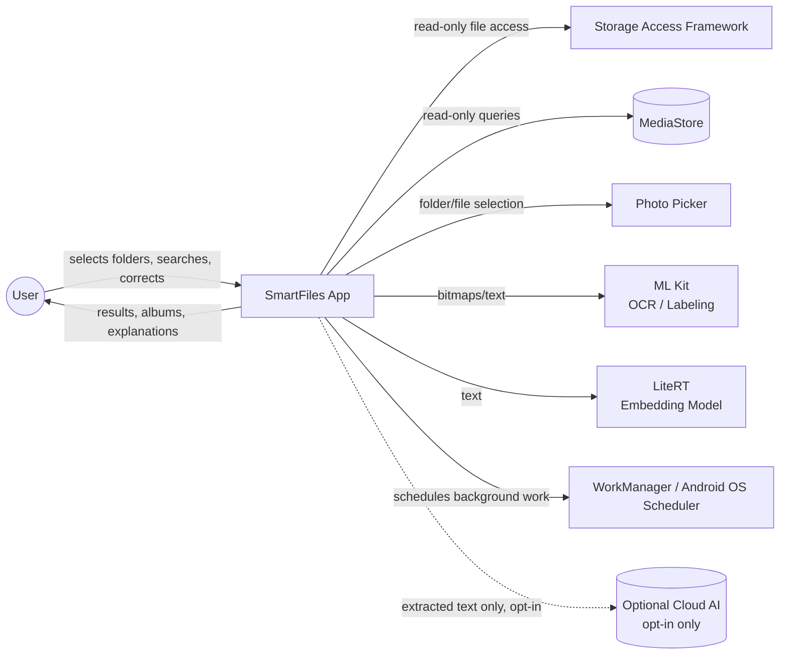
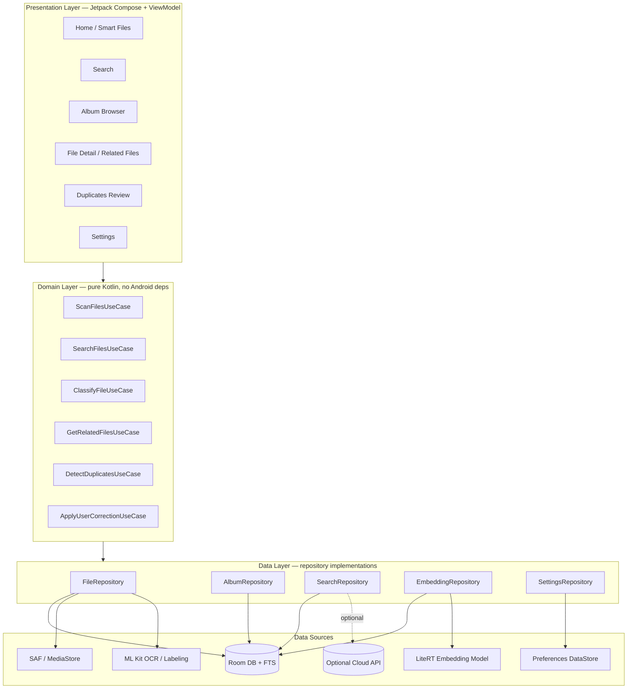
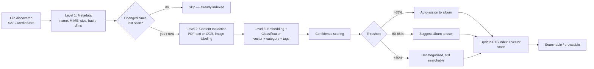
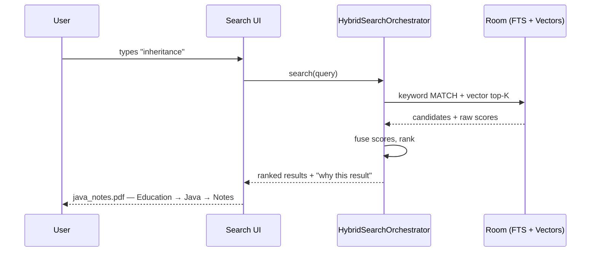

# High-Level Design (HLD)
## SmartFiles — Local AI File Organizer & Semantic Search (Android)

| | |
|---|---|
| **Document version** | 1.0 |
| **Date** | 2026-08-15 |
| **Status** | Draft for engineering review |
| **Source requirements** | Build Specification v1 (provided by product owner) |
| **Companion document** | `SmartFiles-LLD.md` (implementation-level design) |
| **Working project name** | SmartFiles — taken from the spec's own home-screen label; not a final product name |

---

## Table of Contents
1. Executive Summary
2. Purpose & Scope
3. Goals, Non-Goals & Guiding Principles
4. System Context
5. Architectural Style & Layering
6. Module Decomposition
7. Subsystem Overview
8. End-to-End Data Flow
9. Processing Priority Levels
10. Technology Stack
11. Non-Functional Requirements
12. Deployment Topology
13. Key Sequence Flows
14. Risks & Mitigations
15. Assumptions & Constraints
16. Appendix A — Requirement Traceability

---

## 1. Executive Summary

SmartFiles is an on-device Android application that builds a searchable, self-organizing **virtual layer** on top of a user's existing files. It never moves or duplicates the originals. A tiered processing pipeline (cheap metadata → content extraction → embeddings/classification) incrementally understands PDFs, documents, and images; a hybrid keyword+semantic search engine makes them findable by meaning, not just filename; and a confidence-gated classification engine organizes files into a virtual album hierarchy — automatically when it is sure, by suggestion when it isn't, and never silently when it doesn't know. Everything runs locally by default on 4 GB-RAM-class hardware; cloud AI is an explicit, opt-in escape hatch, never a dependency.

The architecture is Clean Architecture / MVVM, modularized by feature and layer, with all AI/ML components wrapped behind small, swappable interfaces so classification, embedding, and OCR strategies can evolve without touching UI or persistence code.

---

## 2. Purpose & Scope

This HLD translates the 28-section Build Specification into an architecture: layers, modules, subsystems, data flow, and the non-functional envelope (RAM, battery, privacy) the system must live inside. It is intentionally implementation-agnostic within those boundaries — file-level class design, schemas, and algorithms live in the LLD.

**In scope:** Phases 1–6 of the spec (indexing, extraction, search, smart organization, semantic search, advanced intelligence). **Out of scope for V1** (spec §25/§27 Phase 7): cloud AI as anything but an optional strategy, cross-device sync, physical file reorganization, document expiry notifications, handwriting-heavy OCR guarantees.

---

## 3. Goals, Non-Goals & Guiding Principles

**Goals**
- Make a messy local file collection searchable by concept, not just filename.
- Organize files into a meaningful, explainable virtual hierarchy without ever touching the originals.
- Run entirely offline by default on mid-range/low-end (4 GB RAM) devices without jank.
- Be honest about uncertainty — confidence scores gate every automatic decision.
- Improve from user corrections without a retraining pipeline.

**Non-Goals (V1)**
- Physically moving/renaming user files.
- Requiring `MANAGE_EXTERNAL_STORAGE`.
- Running a local LLM or large BERT-class model.
- Guaranteeing cloud parity — cloud is a strict opt-in enhancement, not a fallback the app depends on.
- Building a full NLU/chat interface — natural-language queries are parsed with rules + embeddings, not generation.

**Guiding Principles**
1. **Local-first, privacy-by-default.** No file content leaves the device unless the user explicitly opts in, per file class.
2. **Virtual, non-destructive organization.** The filesystem is read-only from the app's perspective; all structure lives in Room.
3. **Confidence gates automation.** Every classification, album creation, and duplicate flag carries a score, and the score — not developer optimism — decides whether it's automatic, suggested, or held back.
4. **Incremental over exhaustive.** Nothing is reprocessed unless something about the file changed; nothing expensive runs unless something cheap already justified it.
5. **Explainability by construction.** Every automatic decision must be able to answer "why," because the underlying score is computed from named signals, not inferred after the fact.
6. **Personalization via correction, not retraining.** The system nudges lightweight statistics (centroids, keyword associations), never trains a model on-device.

---

## 4. System Context



The app has exactly one mandatory external dependency surface: the Android OS storage APIs and on-device ML runtimes. Cloud is drawn with a dashed, optional edge deliberately — the system must be fully functional with that edge removed.

---

## 5. Architectural Style & Layering

**Style:** Clean Architecture with MVVM at the presentation layer, dependency inversion throughout (outer layers depend on inner ones, never the reverse), and a repository pattern isolating every data source (Room, SAF/MediaStore, ML Kit, LiteRT, optional cloud) behind domain-owned interfaces.



Why this shape: the domain layer stays 100% Android-free and testable on the JVM; every AI/ML capability (OCR, embeddings, classification) is reachable only through a repository interface, so the embedding model or OCR engine can be swapped (e.g. a better quantized model next year) without touching a single ViewModel or UseCase.

---

## 6. Module Decomposition

```
app/                     composition root, DI graph, navigation
core/
 ├─ common/              Result wrapper, CoroutineDispatchers, Logger
 ├─ model/                shared domain models (FileItem, Album, Tag, SearchResult…)
 ├─ database/             Room DB, Entities, DAOs, TypeConverters, Migrations
 ├─ datastore/             Preferences DataStore (thresholds, cloud toggle, folders)
 ├─ filesystem/            SAF + MediaStore abstraction, DocumentTree traversal
 ├─ ml/                    LiteRT wrapper, ML Kit wrapper, EmbeddingModelManager
 ├─ workmanager/           Worker base classes, Constraint presets
 └─ designsystem/          Compose theme, shared components
domain/                   UseCases + Repository interfaces (no Android deps)
data/
 ├─ files/                 FileRepositoryImpl
 ├─ albums/                 AlbumRepositoryImpl, ClassificationEngine, DynamicAlbumCreator
 ├─ search/                 HybridSearchOrchestrator, QueryIntentParser, ScoreFusion
 ├─ embeddings/              EmbeddingRepositoryImpl, ChunkedVectorSearch
 ├─ duplicates/              DuplicateDetectionRepositoryImpl
 └─ cloud/                   optional CloudClassificationStrategy, behind interface
feature/
 ├─ onboarding/  ├─ home/  ├─ search/  ├─ albums/
 ├─ filedetail/  ├─ duplicates/  └─ settings/
```

Feature modules depend only on `domain` and `core:designsystem`; they never see `data` or `core:database` directly — that boundary is what keeps the classification/embedding internals swappable without UI churn.

---

## 7. Subsystem Overview

| # | Subsystem | Responsibility |
|---|---|---|
| 1 | File Discovery & Change Detection | Enumerate accessible files via SAF/MediaStore; decide what changed since last scan |
| 2 | Content Extraction | PDF text extraction with OCR fallback; image OCR + labeling |
| 3 | Classification & Tagging Engine | Assign category/album with a confidence score; extract concept tags |
| 4 | Embedding & Semantic Index | Generate, store, and search compact vector representations |
| 5 | Virtual Album Manager | Maintain the album hierarchy; decide auto-create vs. suggest vs. hold |
| 6 | Hybrid Search Engine | Fuse keyword + semantic + filename + metadata signals into ranked results |
| 7 | Duplicate & Version Detection | Exact (hash), near-duplicate (perceptual hash), and version (embedding) grouping |
| 8 | Related Files Engine | Nearest-neighbor + metadata-boosted "files like this one" |
| 9 | User Corrections & Personalization | Store corrections; nudge centroids and keyword associations over time |
| 10 | Background Orchestration | WorkManager scheduling, batching, constraints, retry/backoff |
| 11 | Storage Access Layer | SAF folder grants, permission lifecycle, MediaStore queries |
| 12 | Privacy & Optional Cloud Strategy | Local-by-default processing; opt-in, minimized, consented cloud path |

Each of these is elaborated into concrete classes, schemas, and algorithms in the LLD, §4, using the same numbering.

---

## 8. End-to-End Data Flow



This is the backbone flow every subsystem hangs off; §9 details the three processing levels and §13 shows it as a sequence diagram.

---

## 9. Processing Priority Levels

| Level | Cost | Work | Trigger |
|---|---|---|---|
| **1 — Cheap** | ~ms, no file read beyond stat | filename, MIME, size, date, dimensions, hash (only when changed) | Every scan, unconditionally |
| **2 — Moderate** | tens–hundreds of ms per file | PDF text extraction, OCR, image labeling | Only for new/changed files |
| **3 — Expensive** | up to ~1s per file (model-bound) | Embedding generation, classification, clustering | Only after Level 2 succeeds |

Nothing is promoted to the next level unless the previous level actually produced new information — a file whose size/mtime/hash are unchanged never re-enters this pipeline (LLD §4.1 details the exact change-detection algorithm).

---

## 10. Technology Stack

| Concern | Choice | Rationale |
|---|---|---|
| Language | Kotlin | Coroutines, null-safety, official Android language |
| UI | Jetpack Compose | Declarative, testable, first-class ViewModel integration |
| Architecture | Clean Architecture / MVVM | Testability, swappable AI internals |
| DI | Hilt | Standard, compile-time-safe DI for a modularized app *(LLD-level addition beyond the base spec, for testability)* |
| Database | Room + SQLite | Structured metadata, relations, migrations |
| Keyword search | SQLite FTS4/5 | Fast, embedded, no server |
| Settings storage | Preferences DataStore | Correct tool for simple KV (thresholds, toggles) vs. Room for relational data |
| File access | SAF + MediaStore + Photo Picker | No `MANAGE_EXTERNAL_STORAGE` required |
| PDF | PdfBox-Android | Text extraction + page rendering for OCR fallback |
| OCR | ML Kit Text Recognition | On-device, no network |
| Image labeling | ML Kit Image Labeling | On-device, cheap |
| Embeddings | Quantized sentence-embedding model via LiteRT | Small (target < 30 MB), CPU/NPU-friendly |
| Background work | WorkManager | Constraint-aware, survives process death |
| Concurrency | Kotlin Coroutines | Structured concurrency, cancellation |
| Duplicate detection | SHA-256 + perceptual hashing | Exact + near-duplicate images |
| Vector search | In-process chunked brute-force cosine | Sufficient at personal-collection scale; see LLD §4.4 |
| Cloud | Optional strategy behind an interface | Never a hard dependency |

---

## 11. Non-Functional Requirements

**Performance targets (design targets, to be validated on reference hardware — see LLD §11 Testing):**

| Metric | Target |
|---|---|
| Cold app start | < 1.5 s to interactive home screen |
| Keyword search latency (20k files) | < 150 ms |
| Hybrid search latency (20k files) | < 400 ms |
| Background steady-state RAM | < 200 MB, ideally < 150 MB |
| Peak RAM during embedding generation | Bounded by single in-flight model instance (see LLD §4.4) |
| APK size | < 150 MB including bundled quantized model |

**Memory/storage budget (order-of-magnitude, 384-dim embeddings, float16 storage):** roughly 0.75 KB of vector storage per file → ~38 MB for 50,000 files. Metadata + extracted text + FTS index adds more but remains a small fraction of typical device storage; originals are never duplicated.

**Battery:** all non-user-triggered deep processing runs through WorkManager with `BatteryNotLow` at minimum, and larger batches gated additionally on `Charging + Idle` (LLD §4.10).

**Scalability:** designed for up to ~50,000–100,000 indexed files on a single device using brute-force vector scan in bounded-memory chunks (LLD §4.4); this is expected to comfortably exceed a personal device's real file count, so no ANN index is built for V1 — noted as a future extension point if that assumption changes.

**Security & privacy:** on-device processing by default; no analytics/telemetry by default; optional cloud path sends extracted text only, never raw files, under explicit per-setting consent (LLD §10).

**Maintainability:** strict module boundaries, DI-driven testability, every AI capability behind a small interface (`ContentExtractor`, `ClassificationEngine`, `EmbeddingModelManager`) so it can be replaced independently.

---

## 12. Deployment Topology

Single APK, no backend service for V1 — the entire pipeline in §8 runs in-process. The only external network call the app can ever make is the optional, opt-in cloud classification/embedding call, implemented as one interchangeable `ClassificationStrategy` implementation (LLD §4.12) so a future managed backend could be added later without restructuring the app.

---

## 13. Key Sequence Flows

**13.1 — Onboarding & initial scan**

```mermaid
sequenceDiagram
    participant U as User
    participant UI as Onboarding UI
    participant SAF as SAF Picker
    participant Scanner as MetadataScanWorker
    participant DB as Room DB

    U->>UI: Launch app first time
    UI->>U: "Choose folders to index" (Downloads, Documents, …)
    U->>SAF: Grant folder access (ACTION_OPEN_DOCUMENT_TREE)
    SAF-->>UI: Persistable URI permission
    UI->>Scanner: enqueue initial scan
    Scanner->>SAF: enumerate files in granted trees
    Scanner->>DB: upsert Level 1 metadata for each file
    Scanner->>DB: enqueue Level 2/3 processing for all new files
    Note over Scanner,DB: Deep processing continues in the\nbackground; app is usable immediately
```

**13.2 — Search query execution (high level; full detail in LLD §6)**



---

## 14. Risks & Mitigations

| Risk | Impact | Mitigation |
|---|---|---|
| OEM aggressive battery optimization kills background workers | Indexing stalls silently | WorkManager constraints tuned conservatively; user-triggered "Process now" as an escape hatch with a foreground notification |
| SAF persisted URI permission revoked (OS cleanup, reinstall) | Folder silently stops updating | Periodic `PermissionValidationWorker`; existing index preserved and flagged "needs re-grant," never deleted |
| ML Kit / LiteRT unavailable on very old/rooted devices | OCR or embeddings fail | Feature-detect at startup; degrade gracefully to keyword-only search, surfaced in Settings |
| Thermal throttling during long indexing runs | Slow/erratic background processing | Conservative batch sizes; larger batches only under `Charging + Idle` |
| Embedding model upgraded in a future release | Old vectors incompatible with new ones | `modelVersion` stored per embedding; mismatched rows are queued for re-embedding, not silently mixed into search |
| Perceptual-hash false positives | Wrongly flags distinct images as duplicates | Duplicates are always suggestions requiring explicit confirmation; never auto-deleted |
| Very large single PDF (hundreds of pages, scanned) | OCR cost spikes | Page cap on OCR pass (LLD §13 tunables); remaining pages processed incrementally, not blocking |

---

## 15. Assumptions & Constraints

- Target minSdk 26 (Android 8.0) / targetSdk = latest stable at build time (Play Store requires yearly targetSdk bumps regardless of what's current today).
- Reference low-end device class: ~4 GB RAM, mid-tier CPU, no NPU guaranteed (design must work CPU-only).
- No requirement to support devices without Google Play Services for ML Kit in V1 (noted as an open question if that changes).
- The 12-subsystem decomposition in §7 is authoritative and reused verbatim in the LLD for traceability.

---

## Appendix A — Requirement Traceability (selected)

| Spec section | Topic | Addressed in |
|---|---|---|
| §2 | Automatic album system, dynamic creation | HLD §7 (Subsystem 5), LLD §4.5 |
| §3 | Confidence thresholds | HLD §11, LLD §4.3, §13 tunables table |
| §4 | Virtual (non-destructive) albums | HLD §3 principle 2, LLD §2 DB design |
| §5 | Incremental indexing / change detection | HLD §9, LLD §4.1 |
| §6 | SAF/MediaStore, no MANAGE_EXTERNAL_STORAGE | HLD §10, LLD §4.11 |
| §7–8 | PDF + image processing pipelines | HLD §9, LLD §4.2 |
| §9–10 | Semantic + hybrid search | HLD §7 (Subsystem 6), LLD §4.6 |
| §11 | Small embedding model | HLD §10, LLD §4.4 |
| §12 | Database schema | LLD §2 |
| §14 | User corrections/personalization | HLD §7 (Subsystem 9), LLD §4.9 |
| §15–16 | Related files, duplicate detection | LLD §4.7–4.8 |
| §17–18 | Natural language + voice search | LLD §4.6 (QueryIntentParser) |
| §19–20 | Performance & processing priority | HLD §9, §11 |
| §21–22 | Privacy, battery, storage | HLD §11, LLD §4.12, §10 |
| §26–27 | Tech stack, phased delivery | HLD §10, LLD §14 |
| §28 | Core architectural rule (no File→LLM→Folder) | HLD §5, §8 |

