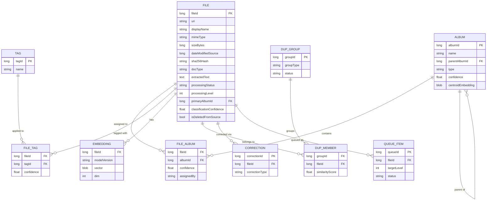
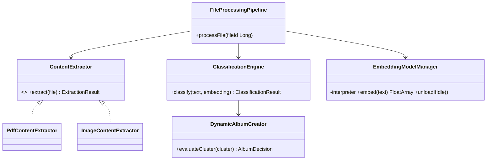
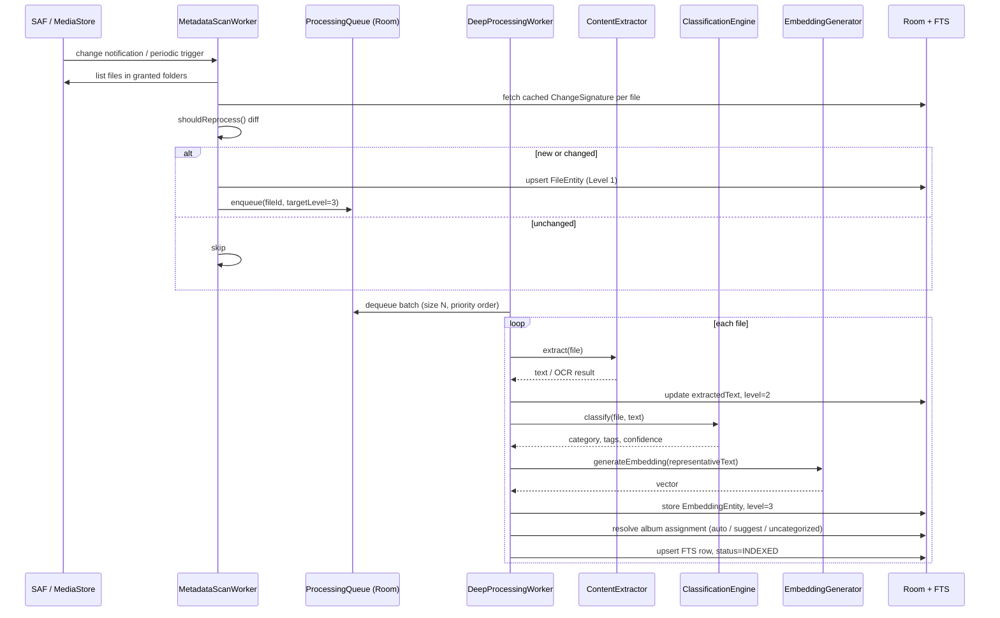
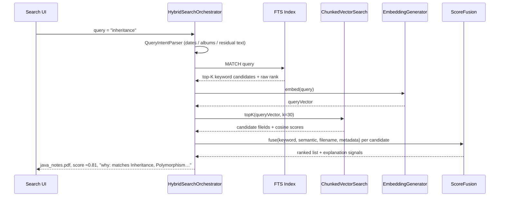
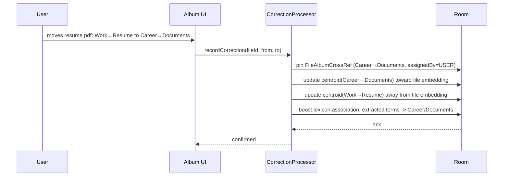
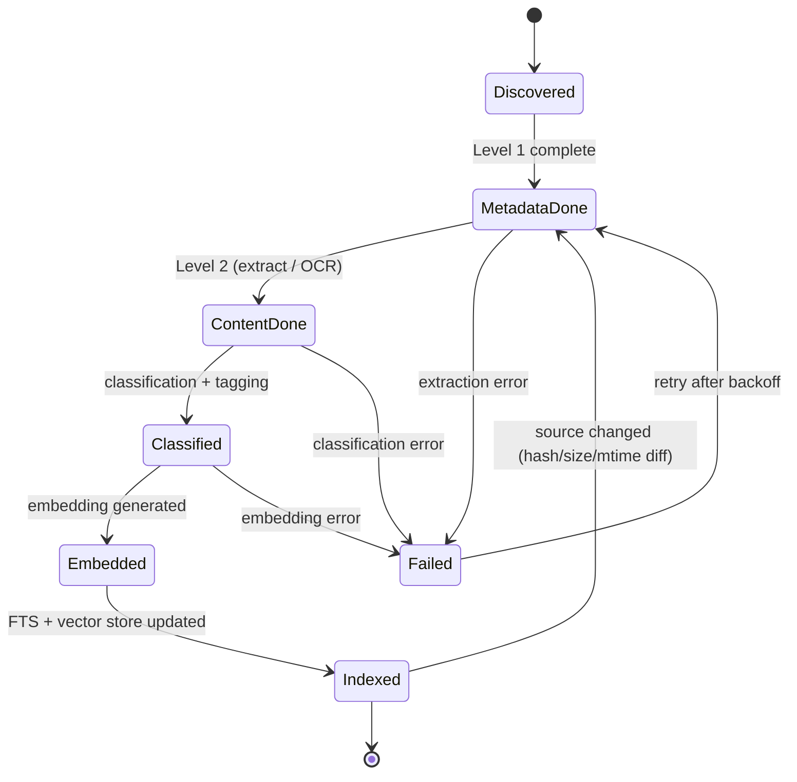
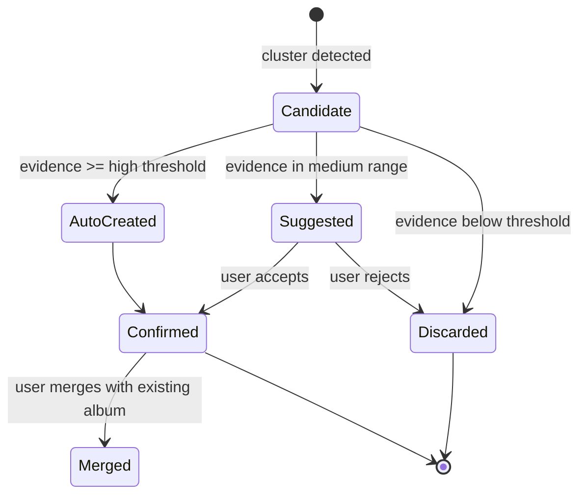

# Low-Level Design (LLD)
## SmartFiles — Local AI File Organizer & Semantic Search (Android)

| | |
|---|---|
| **Document version** | 1.0 |
| **Date** | 2026-08-15 |
| **Status** | Draft for engineering review |
| **Prerequisite** | Read `SmartFiles-HLD.md` first — subsystem numbering (1–12) is identical in both documents |
| **Source of truth** | Original Build Specification = product requirements. This LLD = implementation approach; where it refines or narrows a spec instruction, the rationale is stated inline |

---

## Table of Contents
1. Module & Package Layout (selected detail)
2. Database Design
3. Domain Contracts (Repositories & Use Cases)
4. Component-Level Design (12 subsystems)
5. Core Pipeline Class Diagram
6. Sequence Diagrams
7. State Machines
8. Concurrency & Threading Model
9. Error Handling & Resilience
10. Security Design
11. Testing Strategy
12. Worked Example — End-to-End Trace
13. Configuration & Tunables Reference
14. Extension Points (Deferred Features)

---

## 1. Module & Package Layout (selected detail)

The full module tree is in HLD §6. Three representative modules, expanded to package level:

```
data/embeddings/
 ├─ EmbeddingRepositoryImpl.kt
 ├─ EmbeddingModelManager.kt        (LiteRT lifecycle: load/unload)
 ├─ EmbeddingCodec.kt               (FloatArray <-> float16 ByteArray)
 ├─ ChunkedVectorSearch.kt          (bounded-memory kNN)
 └─ RepresentativeTextBuilder.kt    (filename + text + tags -> embedding input)

data/albums/
 ├─ AlbumRepositoryImpl.kt
 ├─ ClassificationEngine.kt
 ├─ ConfidenceScorer.kt
 ├─ DynamicAlbumCreator.kt
 └─ CategoryLexicon.kt              (curated keyword dictionaries per top-level category)

core/database/
 ├─ AppDatabase.kt
 ├─ entity/ (10 entities, §2.2)
 ├─ dao/ (one interface per entity + SearchDao)
 ├─ Converters.kt
 └─ migrations/
```

---

## 2. Database Design

### 2.1 Entity-Relationship Diagram



### 2.2 Entity Definitions (Room / Kotlin)

```kotlin
enum class ProcessingStatus { DISCOVERED, METADATA_DONE, CONTENT_DONE, CLASSIFIED, EMBEDDED, INDEXED, FAILED }
enum class DocType { PDF, IMAGE, DOCX, OTHER }
enum class AlbumType { PREDEFINED, AUTO_CREATED, USER_CREATED }
enum class AssignmentSource { AUTO, USER, SUGGESTED_ACCEPTED }
enum class QueueStatus { PENDING, IN_PROGRESS, FAILED, DONE }
enum class CorrectionType { RECLASSIFY, TAG_ADD, TAG_REMOVE, DUPLICATE_REJECTED, ALBUM_MERGE }
enum class DuplicateGroupType { EXACT, PERCEPTUAL_NEAR, SEMANTIC_VERSION }
enum class DuplicateGroupStatus { PENDING_REVIEW, RESOLVED, DISMISSED }

@Entity(
    tableName = "files",
    indices = [Index("sha256Hash"), Index("processingStatus"), Index("primaryAlbumId")]
)
data class FileEntity(
    @PrimaryKey(autoGenerate = true) val fileId: Long = 0,
    val uri: String,
    val displayName: String,
    val mimeType: String,
    val sizeBytes: Long,
    val dateModifiedSource: Long,
    val dateFirstIndexed: Long,
    val sha256Hash: String? = null,
    val docType: DocType,
    val widthPx: Int? = null,
    val heightPx: Int? = null,
    val extractedText: String? = null,
    val ocrApplied: Boolean = false,
    val ocrConfidenceAvg: Float? = null,
    val processingStatus: ProcessingStatus = ProcessingStatus.DISCOVERED,
    val processingLevel: Int = 0,
    val primaryAlbumId: Long? = null,
    val classificationConfidence: Float? = null,
    val isDeletedFromSource: Boolean = false,
    val lastError: String? = null
)

@Entity(
    tableName = "albums",
    foreignKeys = [ForeignKey(AlbumEntity::class, ["albumId"], ["parentAlbumId"], onDelete = ForeignKey.SET_NULL)],
    indices = [Index("parentAlbumId")]
)
data class AlbumEntity(
    @PrimaryKey(autoGenerate = true) val albumId: Long = 0,
    val name: String,
    val parentAlbumId: Long? = null,
    val type: AlbumType,
    val confidence: Float? = null,
    val createdAutomatically: Boolean = false,
    val centroidEmbedding: ByteArray? = null,   // float16-packed prototype vector
    val iconOrEmoji: String? = null,
    val createdAt: Long
)

@Entity(
    tableName = "file_album_cross_ref",
    primaryKeys = ["fileId", "albumId"],
    foreignKeys = [
        ForeignKey(FileEntity::class, ["fileId"], ["fileId"], onDelete = ForeignKey.CASCADE),
        ForeignKey(AlbumEntity::class, ["albumId"], ["albumId"], onDelete = ForeignKey.CASCADE)
    ]
)
data class FileAlbumCrossRef(
    val fileId: Long,
    val albumId: Long,
    val confidence: Float,
    val assignedBy: AssignmentSource,
    val assignedAt: Long
)
// A file may legitimately belong to more than one album (spec §12) — this
// table is the many-to-many join; `FileEntity.primaryAlbumId` is a denormalized
// "best" album kept in sync for fast list/detail rendering.

@Entity(tableName = "tags", indices = [Index(value = ["name"], unique = true)])
data class TagEntity(@PrimaryKey(autoGenerate = true) val tagId: Long = 0, val name: String, val category: String? = null)

@Entity(tableName = "file_tag_cross_ref", primaryKeys = ["fileId", "tagId"])
data class FileTagCrossRef(val fileId: Long, val tagId: Long, val confidence: Float)

@Entity(tableName = "embeddings", primaryKeys = ["fileId", "modelVersion"])
data class EmbeddingEntity(
    val fileId: Long,
    val modelVersion: String,   // e.g. "minilm-int8-v1" — enables safe model upgrades
    val vector: ByteArray,      // float16-packed, length = dim * 2 bytes
    val dim: Int,
    val generatedAt: Long
)

@Entity(tableName = "processing_queue", indices = [Index("status"), Index("fileId")])
data class ProcessingQueueEntity(
    @PrimaryKey(autoGenerate = true) val queueId: Long = 0,
    val fileId: Long,
    val targetLevel: Int,
    val priority: Int = 0,          // higher = user-triggered work
    val retryCount: Int = 0,
    val lastAttemptAt: Long? = null,
    val nextEligibleAt: Long = 0,   // backoff gate
    val status: QueueStatus = QueueStatus.PENDING
)

@Entity(tableName = "user_corrections")
data class UserCorrectionEntity(
    @PrimaryKey(autoGenerate = true) val correctionId: Long = 0,
    val fileId: Long,
    val previousAlbumId: Long?,
    val correctedAlbumId: Long?,
    val correctionType: CorrectionType,
    val timestamp: Long
)

@Entity(tableName = "duplicate_groups")
data class DuplicateGroupEntity(
    @PrimaryKey(autoGenerate = true) val groupId: Long = 0,
    val groupType: DuplicateGroupType,
    val representativeFileId: Long? = null,   // user's chosen "keep this one"
    val status: DuplicateGroupStatus = DuplicateGroupStatus.PENDING_REVIEW,
    val createdAt: Long
)

@Entity(tableName = "duplicate_group_members", primaryKeys = ["groupId", "fileId"])
data class DuplicateGroupMemberEntity(val groupId: Long, val fileId: Long, val similarityScore: Float)

@Fts4(contentEntity = FileEntity::class)
@Entity(tableName = "files_fts")
data class FileFtsEntity(val displayName: String, val extractedText: String?, val tagsConcat: String?)
```

**Design note on embeddings:** stored in their own table keyed by `(fileId, modelVersion)` rather than as a column on `FileEntity`. This is deliberate: it lets a future model upgrade re-embed the corpus incrementally while old vectors remain valid for search until replaced, instead of a disruptive all-or-nothing migration.

### 2.3 Representative DAOs

```kotlin
@Dao
interface FileDao {
    @Query("SELECT * FROM files WHERE fileId = :fileId")
    fun observeFile(fileId: Long): Flow<FileEntity?>

    @Query("SELECT sizeBytes, dateModifiedSource, sha256Hash FROM files WHERE uri = :uri")
    suspend fun getChangeSignature(uri: String): ChangeSignature?

    @Upsert suspend fun upsert(file: FileEntity): Long

    @Query("UPDATE files SET processingStatus=:status, processingLevel=:level WHERE fileId=:fileId")
    suspend fun updateStatus(fileId: Long, status: ProcessingStatus, level: Int)

    @Query("SELECT * FROM files WHERE processingStatus != 'INDEXED' ORDER BY dateFirstIndexed LIMIT :limit")
    suspend fun getUnprocessedBatch(limit: Int): List<FileEntity>

    @Query("UPDATE files SET isDeletedFromSource=1 WHERE uri NOT IN (:currentUris)")
    suspend fun markMissingAsDeleted(currentUris: List<String>)
}

@Dao
interface SearchDao {
    @Query("""
        SELECT files.*, files_fts.rank AS ftsRank FROM files_fts
        JOIN files ON files.fileId = files_fts.rowid
        WHERE files_fts MATCH :ftsQuery ORDER BY ftsRank LIMIT :limit
    """)
    suspend fun keywordSearch(ftsQuery: String, limit: Int): List<FileWithRank>
}

@Dao
interface EmbeddingDao {
    @Query("SELECT fileId, vector FROM embeddings WHERE modelVersion=:modelVersion LIMIT :limit OFFSET :offset")
    suspend fun getVectorPage(modelVersion: String, limit: Int, offset: Int): List<EmbeddingRow>

    @Upsert suspend fun upsert(embedding: EmbeddingEntity)
}

@Dao
interface AlbumDao {
    @Query("SELECT * FROM albums WHERE parentAlbumId IS :parentId ORDER BY name")
    fun observeChildren(parentId: Long?): Flow<List<AlbumEntity>>

    @Upsert suspend fun upsert(album: AlbumEntity): Long

    @Query("UPDATE albums SET centroidEmbedding=:centroid WHERE albumId=:albumId")
    suspend fun updateCentroid(albumId: Long, centroid: ByteArray)
}
```

### 2.4 TypeConverters & Codec

```kotlin
class Converters {
    @TypeConverter fun fromStatus(v: ProcessingStatus) = v.name
    @TypeConverter fun toStatus(v: String) = ProcessingStatus.valueOf(v)
    @TypeConverter fun fromDocType(v: DocType) = v.name
    @TypeConverter fun toDocType(v: String) = DocType.valueOf(v)
    // Enum <-> String converters follow the same pattern for the remaining enums.
}

object EmbeddingCodec {
    // Vectors are pre-normalized (unit length) at generation time so cosine
    // similarity reduces to a plain dot product at query time — no per-query
    // normalization pass needed.
    fun encode(vector: FloatArray): ByteArray { /* pack each Float -> 2-byte half-float */ }
    fun decode(bytes: ByteArray, dim: Int): FloatArray { /* unpack half-floats */ }
}
```

### 2.5 FTS & Indexing Notes

- `files_fts` uses **FTS4** with `contentEntity = FileEntity` (external-content table) so the indexed text isn't duplicated on disk — Room synchronizes it via triggers on `files`.
- `tagsConcat` is a denormalized, space-joined string of a file's tags, refreshed whenever `file_tag_cross_ref` changes, purely so a single FTS `MATCH` can search filename + content + tags together.
- Composite index on `(processingStatus, dateFirstIndexed)` is added if profiling shows the unprocessed-batch query needs it at large file counts.

### 2.6 Migration Strategy

Room `AutoMigration` for additive schema changes (new nullable columns); explicit `Migration` objects for anything destructive. `EmbeddingEntity.modelVersion` is the mechanism for handling embedding-model upgrades — no destructive migration is needed for that specific case, just a background re-embedding queue sweep.

---

## 3. Domain Contracts (Repositories & Use Cases)

```kotlin
interface FileRepository {
    suspend fun upsertDiscoveredFiles(files: List<DiscoveredFile>)
    fun observeFile(fileId: Long): Flow<FileItem?>
    fun observeFilesByAlbum(albumId: Long): Flow<List<FileItem>>
    suspend fun updateProcessingResult(fileId: Long, result: ContentExtractionResult)
    suspend fun markDeletedIfMissing(existingUris: Set<String>)
}

interface SearchRepository {
    suspend fun search(query: ParsedQuery): List<RankedSearchResult>
}

interface EmbeddingRepository {
    suspend fun generateAndStore(fileId: Long, representativeText: String)
    suspend fun topKSimilar(queryVector: FloatArray, k: Int, excludeFileId: Long? = null): List<ScoredFileId>
}

interface AlbumRepository {
    fun observeAlbumTree(): Flow<List<AlbumNode>>
    suspend fun assign(fileId: Long, albumId: Long, confidence: Float, assignedBy: AssignmentSource)
    suspend fun proposeNewAlbum(cluster: FileCluster): AlbumProposal
}

interface DuplicateDetectionRepository {
    suspend fun scanForExactDuplicates(): List<DuplicateGroup>
    suspend fun scanForPerceptualDuplicates(): List<DuplicateGroup>
}

interface UserCorrectionRepository {
    suspend fun recordCorrection(correction: UserCorrection)
}
```

```kotlin
class SearchFilesUseCase(
    private val searchRepository: SearchRepository,
    private val queryIntentParser: QueryIntentParser
) {
    suspend operator fun invoke(rawQuery: String): List<RankedSearchResult> =
        searchRepository.search(queryIntentParser.parse(rawQuery))
}
```

(Remaining use cases — `ScanFilesUseCase`, `ClassifyFileUseCase`, `GetRelatedFilesUseCase`, `DetectDuplicatesUseCase`, `ApplyUserCorrectionUseCase` — follow the same one-method, single-responsibility shape and are thin orchestration over the repositories above.)

---

## 4. Component-Level Design

### 4.1 File Discovery & Change Detection

**Classes:** `SafFileDiscoverySource`, `MediaStoreFileDiscoverySource`, `FileChangeDetector`.

The spec (§5) says to use hash + size + modifiedTime to detect change. Computing a SHA-256 over every file on every scan means a full file read each time — expensive and pointless for unchanged files. This LLD splits it into two tiers:

```kotlin
fun shouldReprocess(cached: ChangeSignature?, current: DiscoveredFile): Boolean {
    if (cached == null) return true                                   // never seen
    if (cached.sizeBytes != current.sizeBytes) return true             // cheap check
    if (cached.dateModifiedSource != current.dateModifiedSource) return true
    return false   // size + mtime unchanged -> treated as unchanged, skip
}
// SHA-256 is computed only when shouldReprocess() == true, then stored —
// it exists primarily as the exact-duplicate-detection key (§4.7), not as
// the primary change signal, since it requires reading the full file.
```

This still honors the spec's intent ("don't reprocess unchanged files") while keeping every unchanged file's scan cost at a metadata `stat()`, not a full read.

**Sequence:** see §6.1.

### 4.2 Content Extraction

**Classes:** `ContentExtractor` (interface), `PdfContentExtractor`, `ImageContentExtractor`.

```kotlin
interface ContentExtractor { suspend fun extract(file: DiscoveredFile): ExtractionResult }

class PdfContentExtractor(...) : ContentExtractor {
    override suspend fun extract(file: DiscoveredFile): ExtractionResult {
        val text = PdfBoxTextExtractor.extract(file)
        val avgCharsPerPage = text.length / pageCount(file).coerceAtLeast(1)
        return if (avgCharsPerPage >= MIN_CHARS_PER_PAGE) {
            ExtractionResult(text, source = ExtractionSource.TEXT_LAYER)
        } else {
            val bitmaps = renderPagesToBitmaps(file, maxPages = OCR_MAX_PAGES_PER_DOC)
            val ocrText = bitmaps.map { MlKitOcr.recognize(it).text }.joinToString("\n")
            ExtractionResult(ocrText, source = ExtractionSource.OCR)
        }
    }
}

class ImageContentExtractor(...) : ContentExtractor {
    override suspend fun extract(file: DiscoveredFile): ExtractionResult {
        val bitmap = decodeSampledBitmap(file)          // downsampled, never full-res copy retained
        val ocr = MlKitOcr.recognize(bitmap)
        val labels = MlKitImageLabeling.label(bitmap)    // e.g. Document, Whiteboard, Receipt
        return ExtractionResult(ocr.text, labels = labels, ocrConfidence = ocr.avgConfidence)
    }
}
```

Results are cached by `(fileId, contentHash, extractorVersion)` so re-running the extractor after an app update only reprocesses files whose extraction logic actually changed, not the whole corpus.

### 4.3 Classification & Tagging Engine

**Classes:** `ClassificationEngine`, `ConfidenceScorer`, `CategoryLexicon`, `TagExtractor`, `DynamicAlbumCreator`.

Two distinct decisions happen here, and the spec's thresholds apply to each differently:

**(a) Per-file classification into an existing category** — gated by spec §3's thresholds:

```
classificationConfidence =
      0.45 * categoryKeywordScore        // lexicon/rule match strength, 0..1
    + 0.35 * embeddingToCentroidScore     // cosine similarity to nearest album centroid
    + 0.15 * existingClusterAgreement     // how many already-classified similar files agree
    + 0.05 * userHistoryPrior             // past corrections toward/away from this category

>85%    -> auto-assign to album
60-85%  -> suggest album to user
<60%    -> Uncategorized, but still fully searchable
```

**(b) Creating a *new* sub-album from an emerging cluster** — a separate, cluster-level evidence check (spec §2's "evidence thresholds," which this LLD makes concrete):

```kotlin
fun evaluateNewAlbumCandidate(cluster: List<FileEmbedding>): AlbumDecision {
    val cohesion = averagePairwiseCosineSimilarity(cluster)
    val distinctFromExisting = 1f - maxCosineSimilarityToAnyExistingCentroid(cluster)
    return when {
        cluster.size >= 5 && cohesion >= 0.78f && distinctFromExisting >= 0.35f -> AlbumDecision.AutoCreate
        cluster.size >= 3 && cohesion >= 0.65f -> AlbumDecision.SuggestToUser
        else -> AlbumDecision.KeepUncategorizedButSearchable
    }
}
```

This is why one file mentioning "Quantum Computing" never spawns an album (cluster size 1 fails both branches) while five mutually-similar, sufficiently-distinct files do.

**Tag extraction** avoids an LLM entirely, per spec §2/§17: a curated per-category lexicon (`CategoryLexicon`) boosts recognized domain terms (e.g. "invoice," "due date" → Finance; "certificate," "university" → Identity/Education), combined with corpus-relative TF-IDF over the user's own extracted text for terms outside the lexicon, plus ML Kit's Entity Extraction API for structured spans (dates, addresses) that become filterable metadata rather than free-text tags.

### 4.4 Embedding & Semantic Index

**Classes:** `EmbeddingModelManager`, `EmbeddingGenerator`, `RepresentativeTextBuilder`, `ChunkedVectorSearch`.

**Model lifecycle:** the LiteRT interpreter is not kept resident. `EmbeddingModelManager` lazily loads it on first use and unloads it after `MODEL_IDLE_UNLOAD_MS` (default 60s) of inactivity, tracked by a coroutine watchdog. All calls are serialized onto a single-thread dispatcher (§8) — LiteRT/ML Kit interpreters are not safe for concurrent multi-thread inference, and serializing also caps peak memory to one in-flight model.

**Representative text:** rather than embedding an entire document, `RepresentativeTextBuilder` composes `filename + first ~500 tokens of extracted text + top extracted tags` into one string per file — this keeps inference cost and memory bounded regardless of source document length, while still capturing the signal that matters for retrieval.

**Vector search at mobile scale.** Doing the math: 384-dim, float16 → 768 bytes/vector → ~38 MB for 50,000 files. Holding that permanently resident is avoidable, so search streams the table in bounded pages instead:

```kotlin
suspend fun topKSimilar(query: FloatArray, k: Int, chunkSize: Int = VECTOR_SEARCH_CHUNK_SIZE): List<ScoredFileId> {
    val heap = BoundedMinHeap<ScoredFileId>(capacity = k)
    var offset = 0
    while (true) {
        val page = embeddingDao.getVectorPage(currentModelVersion, chunkSize, offset)
        if (page.isEmpty()) break
        for (row in page) {
            val score = dot(query, EmbeddingCodec.decode(row.vector, row.dim))  // pre-normalized -> cosine == dot
            heap.offerIfBetter(ScoredFileId(row.fileId, score))
        }
        offset += chunkSize   // page discarded after scoring; peak memory bounded by chunkSize, not corpus size
    }
    return heap.sortedDescending()
}
```

At ~50–100k files this brute-force chunked scan is expected to complete in tens of milliseconds on typical mobile CPUs and keeps peak memory flat regardless of corpus size. An approximate-nearest-neighbor index is deliberately **not** built for V1 — noted as an extension point (§14) if a user's collection ever grows well beyond that.

### 4.5 Virtual Album Manager

**Classes:** `AlbumAssignmentEngine`, `AlbumHierarchyResolver`.

Seeds a predefined top-level taxonomy (Education, Career, Finance, Identity, Photos, Uncategorized) per spec §2; everything beneath the top level is created dynamically via `DynamicAlbumCreator` (§4.3b). `AlbumAssignmentEngine` applies the file-level thresholds (§4.3a) and writes to `FileAlbumCrossRef`, updating `FileEntity.primaryAlbumId` as the highest-confidence assignment for fast list rendering.

### 4.6 Hybrid Search Engine

**Classes:** `HybridSearchOrchestrator`, `QueryIntentParser`, `ScoreFusion`.

**Score fusion:**

```kotlin
data class FusionWeights(val keyword: Float = 0.30f, val semantic: Float = 0.40f,
                          val filename: Float = 0.20f, val metadata: Float = 0.10f)

fun fuse(keyword: Float, semantic: Float, filename: Float, metadata: Float, w: FusionWeights): Float {
    fun norm(s: Float) = s.coerceIn(0f, 1f)
    return w.keyword * norm(keyword) + w.semantic * norm(semantic) +
           w.filename * norm(filename) + w.metadata * norm(metadata)
}
```

Retrieval pattern is standard hybrid search: run keyword FTS and vector top-K independently, **union** the candidate sets, then compute all four component scores for every candidate before fusing and re-ranking — a file that only one method found still gets a fair fused score rather than being dropped for lacking the other signal.

**Natural-language queries** (spec §17) are handled without an LLM: `QueryIntentParser` strips stock phrases ("find my," "show," "documents related to"), extracts date expressions and known album names via ML Kit Entity Extraction + fuzzy match against existing album names, and passes whatever free text remains as the semantic/keyword query. **Voice search** (spec §18) is just speech-to-text feeding this same parser — no separate pipeline.

See §12 for a full worked trace of this formula.

### 4.7 Duplicate & Version Detection

**Classes:** `ExactDuplicateFinder`, `PerceptualDuplicateFinder`, `SemanticVersionDetector`.

| Type | Method | Threshold |
|---|---|---|
| Exact | `GROUP BY sha256Hash HAVING COUNT(*) > 1` | bit-identical |
| Near-duplicate image | 64-bit perceptual hash (pHash), Hamming distance | ≤ 5 bits → near-duplicate; 6–10 → softer "similar" grouping |
| Document version | Filename stem/version-suffix pattern **and** embedding cosine similarity | ≥ 0.92 |

Perceptual hashes are computed during the Level 2 image pass (the bitmap is already decoded for OCR/labeling, so this piggybacks on that decode rather than re-opening the file). Comparison uses bucketing on the hash's high bits to avoid an O(n²) scan as the image collection grows. **No duplicate is ever auto-deleted** — every group surfaces in a review UI requiring explicit user action, and a "not a duplicate" dismissal is stored as a correction (§4.9) to suppress that pair in future scans.

### 4.8 Related Files Engine

**Class:** `RelatedFilesResolver`.

```kotlin
suspend fun relatedTo(fileId: Long): List<RelatedFile> {
    val base = embeddingRepository.vectorFor(fileId)
    return embeddingRepository.topKSimilar(base, k = RELATED_FILES_TOP_K, excludeFileId = fileId)
        .map { it.withMetadataBoost(sameAlbum = +0.05f, sharedTagCapped = +0.02f, sameFolder = +0.03f) }
        .filter { it.score >= RELATED_FILES_MIN_SIMILARITY }
        .sortedByDescending { it.score }
}
```

The minimum-similarity floor is what keeps "Related Files" from ever showing genuinely unrelated files just to fill a list — an empty or short list is the correct output when nothing is actually related.

### 4.9 User Corrections & Personalization

**Class:** `CorrectionProcessor`.

Two effects per correction, matching spec §14's "personalized without a huge ML pipeline":

1. **Immediate, file-level:** the corrected album assignment is written directly and marked "pinned" — future re-classification passes won't silently revert it unless the user re-triggers classification for that file.
2. **Aggregate, slow-moving:** the corrected album's centroid is nudged toward the file's embedding with a small online update, `newCentroid = oldCentroid + lr * (fileEmbedding - oldCentroid)` (`lr` default 0.05), and nudged slightly away from the previously-predicted album's centroid. In parallel, terms found in the file's extracted text get a small association boost toward the corrected category in the lexicon-scoring step (§4.3a). No model is retrained — only these two lightweight, incremental statistics move.

### 4.10 Background Orchestration (WorkManager)

| Worker | Trigger | Constraints | Batch size |
|---|---|---|---|
| `MetadataScanWorker` | App open, periodic (~4h), MediaStore/SAF change observer | none (lightweight) | unbounded (Level 1 only) |
| `DeepProcessingWorker` (background) | Queue non-empty | `BatteryNotLow` | 5 files/run |
| `DeepProcessingWorker` (boosted) | Same unique work, re-evaluated by WorkManager | `Charging + Idle` | 20 files/run |
| `UserTriggeredProcessingWorker` | "Process now" button | none, expedited, foreground notification | full queue, cancelable |
| `DuplicateScanWorker` | Duplicates screen opened, or weekly | `BatteryNotLow` | full corpus, batched internally |
| `PermissionValidationWorker` | Daily | none | N/A |

`MetadataScanWorker` prefers `ContentObserver`/`DocumentsContract` change notifications over blind polling where the platform provides them, so most scans after the first are near-instant no-ops. `DeepProcessingWorker` dequeues from `ProcessingQueueEntity`, advancing `processingLevel` after each stage so a killed/rescheduled worker resumes rather than restarts.

### 4.11 Storage Access Layer

`ACTION_OPEN_DOCUMENT_TREE` for folder grants; `ContentResolver.takePersistableUriPermission` to survive reboots; `DocumentFile` tree traversal with a depth limit and exclusion list (`.thumbnails`, hidden dirs). MediaStore is queried in parallel for broadly-indexed media the OS already knows about, so the user isn't forced to grant a full tree just to include their camera roll. `PermissionValidationWorker` re-checks grants daily and flags (never deletes) any folder whose permission has lapsed.

### 4.12 Privacy & Optional Cloud Strategy

```kotlin
interface ClassificationStrategy {
    suspend fun classify(text: String): ClassificationResult
}
class LocalClassificationStrategy(...) : ClassificationStrategy { /* default, always available */ }
class CloudClassificationStrategy(...) : ClassificationStrategy {
    // Sends extracted text only — never raw files/images — over TLS, only for
    // files the user has allowed, and logs what was sent to a local,
    // user-visible audit trail for transparency.
}
```

Selected at runtime via `ProcessingModeRepository`, backed by DataStore. The Strategy pattern means the entire rest of the pipeline is unaware which implementation is active — the classification call site never branches on "is cloud enabled."

---

## 5. Core Pipeline Class Diagram



---

## 6. Sequence Diagrams

### 6.1 Full Indexing Pipeline



### 6.2 Hybrid Search Execution



### 6.3 User Correction Feedback Loop



---

## 7. State Machines

**File processing status**



**Album lifecycle**



---

## 8. Concurrency & Threading Model

| Dispatcher | Used for |
|---|---|
| `Dispatchers.IO` | File reads, hashing, Room access |
| `Dispatchers.Default` | CPU-bound work: TF-IDF, perceptual hashing, score fusion |
| `mlInferenceDispatcher` (`Dispatchers.Default.limitedParallelism(1)`) | ML Kit + LiteRT calls — serialized to bound peak memory and avoid concurrent-interpreter issues |
| `Dispatchers.Main.immediate` | UI state updates only |

WorkManager enforces at most one `DeepProcessingWorker` instance at a time via unique work (`ExistingWorkPolicy.KEEP`), so batch size (§4.10 table) is the only real concurrency knob for background processing — deliberately conservative, per HLD §11's memory budget.

---

## 9. Error Handling & Resilience

| Failure | Handling |
|---|---|
| Corrupt/unreadable PDF | `FAILED` + `lastError`; metadata still indexed/searchable by filename; retry ×3 with backoff, then left in Uncategorized rather than blocking the queue |
| Low-confidence OCR | Text stored anyway with `ocrConfidenceAvg` flagged; surfaced as "low-confidence OCR" in the explanation UI; still searchable |
| Embedding generation crash/OOM | Caught, embedding skipped for that file (keyword search still works), retried next cycle |
| SAF permission revoked | Detected by `PermissionValidationWorker`; folder flagged "needs re-grant"; existing index preserved, not deleted |
| File deleted from source | Detected when URI no longer resolves; soft-deleted (`isDeletedFromSource=true`), hidden from UI, purged after a grace period |
| Duplicate false positive | Never auto-deleted; "not a duplicate" is stored as a correction to suppress re-flagging that pair |
| Cloud request failure (opt-in mode) | Falls back to the local-only result for that file; never blocks core functionality |

---

## 10. Security Design

- **Encrypted local index (optional, spec §25):** the Room layer is built behind a `SupportSQLiteOpenHelper.Factory` seam so SQLCipher's `SupportFactory` can be swapped in later without touching DAOs/entities.
- **Keystore:** any local encryption key is wrapped via Android Keystore, never stored in plaintext.
- **Network:** `usesCleartextTraffic = false`; the only network-capable code path is `CloudClassificationStrategy` (§4.12), which is unreachable unless the user has explicitly enabled cloud processing.
- **No default telemetry/analytics** — consistent with the spec's privacy stance; anything added later must be opt-in and disclosed.
- **No file duplication:** only derived artifacts (extracted text, embeddings, thumbnails) are stored in app storage; thumbnails use the OS's existing thumbnail APIs (`ContentResolver.loadThumbnail` / `MediaStore.Images.Thumbnails`) rather than the app generating and retaining full-resolution copies.

---

## 11. Testing Strategy

| Layer | Approach |
|---|---|
| Domain logic | Pure JVM unit tests — `ConfidenceScorer`, `ScoreFusion`, `DynamicAlbumCreator` thresholds, `QueryIntentParser`, `FileChangeDetector` |
| Persistence | Instrumented tests against an in-memory Room DB, including FTS queries |
| Storage access | Instrumented tests against a test `DocumentProvider`; `WorkManager` via `TestListenableWorkerBuilder` |
| ML components | Golden-file tests on a fixed OCR/embedding fixture set; embedding stability checks (same input → same vector within tolerance) across app/model versions |
| Performance | Macrobenchmark (cold start), Microbenchmark (search/classification hot paths), memory profiling with 10k/50k-file synthetic corpora |
| Device matrix | At least one true 4 GB reference device (primary target), one 6–8 GB mid device, one flagship (regression headroom) |

---

## 12. Worked Example — End-to-End Trace

Following `java_notes.pdf` through the full pipeline, using the parameters defined above:

1. **Discovery:** SAF scan finds `/Download/java_notes.pdf`. No cached `ChangeSignature` → `shouldReprocess = true`.
2. **Level 1:** `FileEntity` inserted; `docType=PDF`; SHA-256 computed and stored (for future dedup); `processingStatus=METADATA_DONE`; enqueued at `targetLevel=3`.
3. **Level 2:** PdfBox extracts a text layer; average chars/page well above `PDF_MIN_CHARS_PER_PAGE` (40) → text layer used directly, no OCR.
4. **Classification:** lexicon match hits "Inheritance," "Polymorphism," "Abstraction," "Encapsulation," "class," "object" → `categoryKeywordScore = 0.88`. Embedding-to-centroid similarity against the existing Education→Java centroid → `0.91`. Four already-classified files agree → `existingClusterAgreement = 0.90`. No correction history → `userHistoryPrior = 0.50` (neutral default).

   `confidence = 0.45(0.88) + 0.35(0.91) + 0.15(0.90) + 0.05(0.50) = 0.8745 → 87%`

   Above the 85% threshold → **auto-assigned** to `Education → Java → Notes` (sub-album chosen by a secondary filename/content pattern: "notes" vs. "assignment" vs. "lab").
5. **Tags:** `#Java #OOP #Inheritance #Polymorphism #Abstraction #Encapsulation`.
6. **Embedding:** representative text = filename + first ~500 tokens + top tags → 384-dim vector, stored float16, `modelVersion="minilm-int8-v1"`.
7. **Index update:** FTS row upserted; `processingStatus=INDEXED`.
8. **Later search — "inheritance":** FTS match → `keywordScore ≈ 0.82`; query embedding vs. document → `semanticScore ≈ 0.94`; filename contains no match but partial/stem overlap → `filenameScore ≈ 0.70`; query carries no category signal → `metadataScore ≈ 0.50` (neutral).

   `final = 0.30(0.82) + 0.40(0.94) + 0.20(0.70) + 0.10(0.50) = 0.812 → ~81%`

   Displayed as *java_notes.pdf — Education → Java → Notes, ~81% match* with the explanation: *"Contains Inheritance, Polymorphism, Abstraction, OOP."* (The Build Specification's own illustrative figure for this scenario was 89% — consistent with the same mechanism; the exact fused score depends on the tuned weight vector, which is why weights are exposed as configurable parameters in §13 rather than hard-coded.)

---

## 13. Configuration & Tunables Reference

| Parameter | Default | Meaning |
|---|---|---|
| `CONFIDENCE_AUTO_THRESHOLD` | 0.85 | Auto-organize a file into an album |
| `CONFIDENCE_SUGGEST_THRESHOLD` | 0.60 | Suggest an album to the user |
| `NEW_ALBUM_MIN_CLUSTER_SIZE` | 5 | Files needed to auto-create a sub-album |
| `NEW_ALBUM_COHESION_THRESHOLD` | 0.78 | Required average pairwise cosine similarity |
| `NEW_ALBUM_DISTINCTIVENESS_THRESHOLD` | 0.35 | 1 − max similarity to any existing centroid |
| `DUPLICATE_PHASH_HAMMING_NEAR` | 5 (of 64 bits) | Near-duplicate image threshold |
| `DUPLICATE_PHASH_HAMMING_SIMILAR` | 10 (of 64 bits) | Softer "similar images" grouping |
| `VERSION_COSINE_THRESHOLD` | 0.92 | Semantic document-version grouping |
| `RELATED_FILES_MIN_SIMILARITY` | 0.55 | Minimum score to display as related |
| `RELATED_FILES_TOP_K` | 8 | Max related files shown |
| `SEARCH_WEIGHT_SEMANTIC` | 0.40 | Hybrid fusion weight |
| `SEARCH_WEIGHT_KEYWORD` | 0.30 | Hybrid fusion weight |
| `SEARCH_WEIGHT_FILENAME` | 0.20 | Hybrid fusion weight |
| `SEARCH_WEIGHT_METADATA` | 0.10 | Hybrid fusion weight |
| `EMBEDDING_DIM` | 384 | Vector dimensionality |
| `MODEL_IDLE_UNLOAD_MS` | 60,000 | Unload embedding model after this idle period |
| `DEEP_BATCH_SIZE_BATTERY` | 5 | Files/run without charging |
| `DEEP_BATCH_SIZE_CHARGING` | 20 | Files/run while charging + idle |
| `VECTOR_SEARCH_CHUNK_SIZE` | 2,000 | Rows scanned per DB page during kNN |
| `PDF_MIN_CHARS_PER_PAGE` | 40 | Below this, OCR fallback triggers |
| `OCR_MAX_PAGES_PER_DOC` | 20 | Caps OCR cost on very large scanned PDFs |
| `CORRECTION_LEARNING_RATE` | 0.05 | Centroid nudge strength per correction |

All values live in Preferences DataStore behind a `SettingsRepository`, editable from the Settings screen per spec §3 ("thresholds should be configurable").

---

## 14. Extension Points (Deferred Features)

Per spec §25/§27, these are architecturally anticipated but **not built in V1** — each has a seam already designed above so it can be added without restructuring:

| Feature | Seam already in place |
|---|---|
| Cross-device sync | `EmbeddingEntity.modelVersion` + export-friendly schema |
| Approximate nearest neighbor index | `ChunkedVectorSearch` is behind `EmbeddingRepository.topKSimilar` — swappable |
| Encrypted local index | Room `SupportFactory` seam (§10) |
| Managed cloud backend | `ClassificationStrategy` interface (§4.12) |
| Document/certificate expiry reminders | ML Kit date entities already extracted (§4.6); just needs a notification scheduler on top |
| Export/import of the app index | Domain models already decoupled from Room entities via mappers (§3) |

